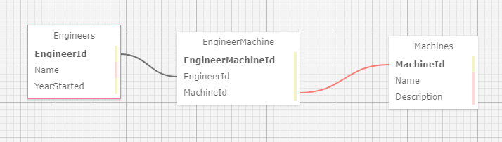
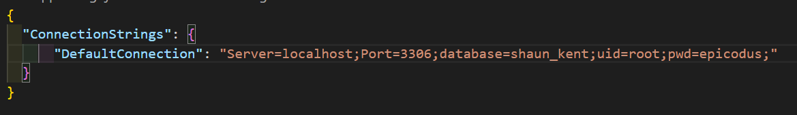

# Three Gears Logistics

### A C-sharp application that keeps track of Engineers and Machines for Dr.SillyStringz's

### By Shaun Kent

## Technologies Used

* C#

* .NET 5.0

* Git/Github

* AspNet Core(Model, View, Controller)

* MySQL

* EntityCore Framework

* Bootstrap

## Description

A C# application for Dr.SillyStringz's which allows him to manage the Engineers and machines in his factory. The applicationi allows the Doctor to add engineers and machines seperately then allows him to navigate to another page to connect engineers and the machines they are licensed to work on. The application uses EntityCore Framework migrations to manage the CRUD features of the database.

The relationship between the Engineeers and Machines is a many-to-many relationship

* An engineer can repair many machines
* A Machine can have many engineers who can repair it

## Schema

## Setup/Instillation Requirements

* Download .NET 5.0 SDK for Windows:`https://dotnet.microsoft.com/download/dotnet/thank-you/sdk-5.0.102-windows-x64-installer` 

* Download .NET 5.0 SDK for Mac: `https://dotnet.microsoft.com/download/dotnet/thank-you/sdk-5.0.100-macos-x64-installer`

* Open command line in directory where you want the project stored.

* In the command line enter: `git clone https://github.com/SKona306/DrSillyStringzsFactory.Solution.git`

* Open the newly cloned project directory in code editor of choice.

* Create you own database by:
1. Download dotnet entityframework to device.
2. To download, in command line on root directory paste `dotnet tool install --global dotnet-ef --version 5.0.10`
3. To recreate the database enter `dotnet ef database update` in command line

* Cd into the `Factory` directory and create a file by entering `touch appsettings.json` in command line

* Navigate to the `appsettings.json` file and enter: 

* Run Application:
1. `cd` to root directory
2. In console enter: `cd Factory`
3. To build the project in the console enter: `dotnet build` 
4. To run the project in the console enter: `dotnet run`
5. To see application in browser press CTRL + click http link that appears after `dotnet run`
6. To exit program press CTRL + c

## Bugs in Application
* WORK IN PROGRESS: The user is unable to edit, delete both engineers and machines and is unable to attach engineers to machines and vice versa.
## License 

[MIT](https://choosealicense.com/licenses/mit/)

## Contact Information

* shaunkent81@gmail.com